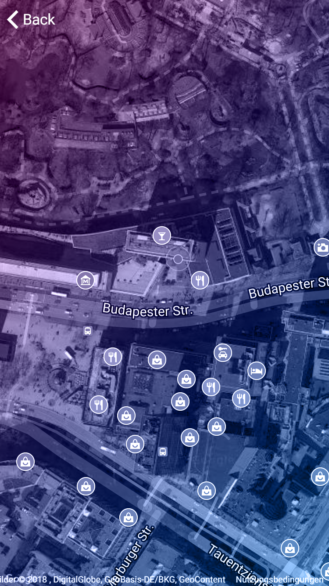
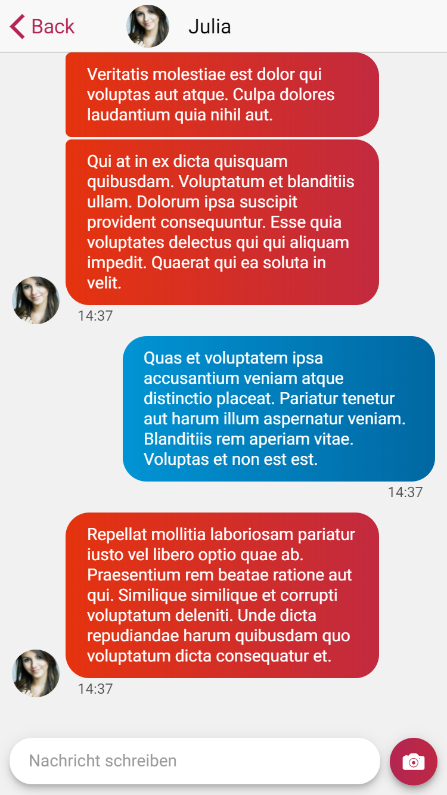

# hispot-app

Functional prototype for a cross-platform location based dating app using [Ionic](https://ionicframework.com/). It communicates with a [node.js server](https://github.com/LdwgWffnschmdt/hispot-server) via [GraphQL](https://graphql.org/).

The code in this repository is available under the MIT license. All rights regarding app idea and brand design belong to Caner Toku.